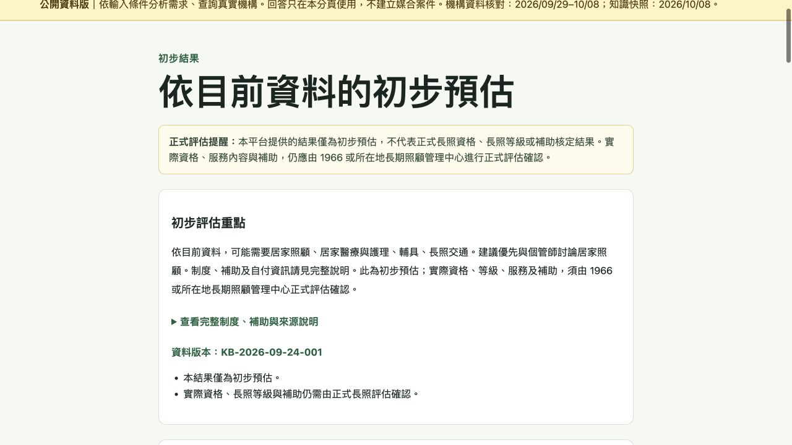
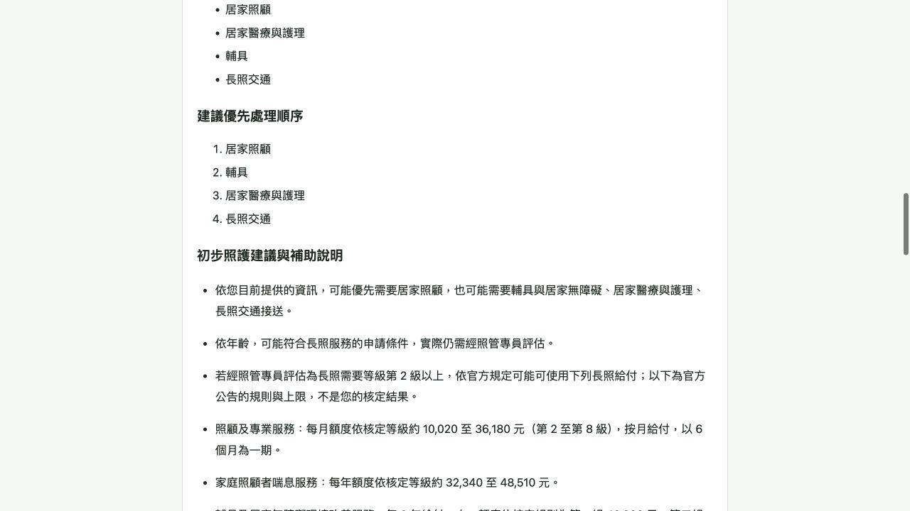

# C-009-r2 / J-004-r16 — Readable assessment and case-manager summary

Date:2026-10-08. Owner request: preliminary assessment within200 characters; a fuller, readable bullet handout for case managers. Central execution is authorized for frontend and related spec/tasks/public Pages publication. No backend, schema, dataset, consent or assessment-rule changes.

## Result

The result page displays a short overview derived only from structured careNeeds/priority. It keeps full policy text and sources verbatim in a native keyboard-accessible details disclosure, with knowledge version and warnings visible. The case-manager view, copied text and print layout use complete bullet items; no source conditions, rates or figures are truncated or recalculated. Existing formal reminders and five approved questions are retained. No data is saved or transmitted by summary generation.

## Verification

- Frontend87/87 tests passed, including all16 combinations of service needs staying within200 Unicode characters and full policy details retained in the handout.
- Real API mode typecheck/build passed. git diff --check passed.
- Actual local browser journey with a fictional case: New Taipei/Banqiao, all four service needs, disability YES and GENERAL income. Visible overview111 characters; complete original policy text expanded successfully; case-manager handout has25 full policy bullet points, plus needs/priority/questions/version/date.
- Clicking copy displayed the success message. The browser connector clipboard-read surface returned empty, so raw clipboard readback is not counted as verified; the pure-text content and complete-bullet consistency are verified by functional unit tests. Printing uses the existing browser-native action and existing print-only-summary CSS; no new browser print-dialog execution is claimed.
- Local screenshots below show the new overview and policy bullets. Public publication and actual target source/version will be recorded in this PR's conversation after merge. These LOCAL/UI checks do not replace49 formal deployed E2E cases.

