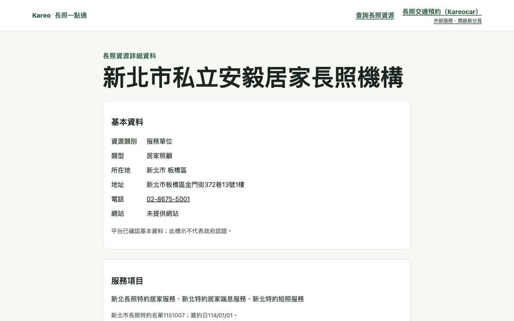

# J-003-r28 / J-004 — Public data quality and deployed UI verification

2026-10-09. Central execution under Jerry's existing task/data/publication authorization. Kareo only; existing acceptance Supabase `ojawadobnaxduxybqolk`. Integrated remains **false**.

## Reviewed correction

[PR #115](https://github.com/viz963-1216/Kareo/pull/115), head `7f9a925764cb6d7e00bdcad05affc7ab61721439`, merged to staging `569f19ce1f4b50965025c604d1a838ecd7828d1b`. All eight CI jobs plus Local HTTP integration passed; Supabase Preview intentionally skipped. Data QA 73 PASS and isolated phone patch 2 PASS, including missing/stale rows rejecting the entire patch and repeated execution retaining the same values.

The official PDF was downloaded again with certificate verification enabled and matched SHA256 `dcb780dfe853f176849b366436c8cc3ac742b289759c0a8ec68106854e64cdef`. Nineteen newly added public institution phones had been concatenated across PDF line breaks; only their `phone` fields were corrected to the first source number. Wrapped extensions remain. Alternate numbers remain in the unmodified source extract and manifest. The original 800 providers and all existing service/area/contract rows remain protected.

Cloud correction ran the reviewed `data/providers/qa/ntpc-phone-correction.sql`, locking and checking all 19 IDs/old values before updates. No schema, RLS, credentials, consent, health or contact-case writes. Read-back: 1118 providers /1117 ACTIVE, zero concatenated primary numbers in the new NTPC rows. Sessions remained10; Consents/Assessments/Leads remained0. Before/after ordered JSON equality fingerprints:

| Protected data | Before and after MD5 |
|---|---|
| Other 1099 complete Provider rows | `51565048fc5d11f60bd1ee0db30474fe` |
| Target19 Provider rows, excluding phone | `6e07020637ad9b8c7418d8267200279a` |
| All ProviderServices | `6426a9ee626ce9c295762c5f4d62e6d9` |
| All ProviderServiceAreas | `bf4b1112030f0a88b7ab1e1299c2ca3f` |
| All ProviderContractRegions | `91697618d556c0aa9cf5e9659952358a` |

These fingerprints establish before/after equality, not cryptographic provenance. Official provenance uses the separate SHA256 snapshot checks.

## Actual deployment and public checks

Netlify production remains release commit `56500c835df2869ad7e4540f6f0730cb31ccbbcd`, deploy `6ac7631c4b91470008fb7960`. Runtime public data was corrected without a Netlify rebuild. All19 actual GET detail responses returned the expected new phone, with matching deployed SHA before and after; unmodified receipt: [live verification](evidence/A008-2026-10-09-live-phone-verification.json).

Actual browser observations on this deployment:

- All-resource lookup displayed1117. HOME_CARE / 新北市 / SERVICE_AREA displayed365, disclosed9 unknown institutions, and page2 of19 showed a changed institution list.
- 新北市／板橋區／安毅 returned one actual institution. Updated card and detail consistently displayed `02-8675-5001`, official source, address and ten confirmed New Taipei districts. No direct 我要媒合 link was present on the public detail.
- A nonexistent institution-name query displayed0 and1966 guidance; a nonexistent detail ID displayed 找不到這項資源.
- Assistive-device-center category displayed17 real centers; service-type selector was disabled. Centers remain query-only, not service-provider recommendations.
- `/info` displayed published `KB-2026-09-24-001`, official source links, effective dates and the non-qualification reminder. 新北市＋喘息服務 displayed a safe empty result while preserving the published version and1966 guidance.
- Maps href equalled the actual Provider's value, with `target=_blank` and `rel=noopener noreferrer`. A click was attempted, but the tool did not expose an opened Maps tab; successful external navigation is not claimed.
- Viewport override requests375/768 were attempted and reset, but observed DOM client width stayed1280. No mobile/tablet RWD result is accepted from those attempts.

GitHub Pages public snapshot was separately rebuilt from clean staging `569f19ce1f4b50965025c604d1a838ecd7828d1b`, published by ordinary push to the existing demo-pages artifact branch `d4ae66a4ce660d01d47f3e0782675ff312d43f2b`. [Pages workflow37895297943](https://github.com/viz963-1216/Kareo/actions/runs/37895297943) succeeded; the actual Pages manifest matched source569f19c and providerCount1118. Actual Pages browser detail also displayed 安毅 and `02-8675-5001`. Pages retains a static data snapshot/local rules; it does not query the Supabase API or qualify as real deployment E2E.

## Acceptance boundary and next work

The recorder generated `tests/e2e/results/public-ui-2026-10-09.json` against the observed Netlify SHA. E2E-12/44/47/48 remain PENDING because the observations cover only subsets: external Maps navigation, deployed network failure/retry, exhaustive no-session request capture, contract-city interaction, no-version UI, and recommendation/Lead comparisons remain unverified. Unchanged aggregate counts are supporting evidence; they alone do not prove that no Session endpoint was called. No full-main-flow/RWD PASS was invented, and no published knowledge was withdrawn to simulate an error.

D-05 stays DRAFT and personal-case APIs are not opened by this correction. The49 mandatory cases remain intact. Remaining work: complete the public error/navigation checks in a browser that exposes those operations; complete D-05 engineering activation conditions and real main-flow acceptance; reconcile the New Taipei home-medical/nursing directory and directly verified unknown assistive service coverage. ContractCity currently applies to assistive-device contracts per DATA_MODEL §19b; a HOME_CARE contractCity query returning0 is not evidence that the official home-care catalogue is absent.

Latest full gate: **116 PASS,0 FAIL,48 PENDING; RELEASE GATE FAILED**, expected while required acceptance is pending. No result was promoted merely because the data correction succeeded.

## Scheduled operations read-only verification

Read actual run metadata and decoded job logs, not just a green job badge. [Cleanup schedule run37846636139](https://github.com/viz963-1216/Kareo/actions/runs/37846636139), job113549025364, event=schedule, staging `f311f2c`, logged `Mode: commit`, `Status: SUCCESS` at2026-10-08T21:25:27Z. Sessions/Leads/Consents deleted were each0. This proves an authenticated scheduled cleanup invocation completed; it does not by itself prove nonzero expired data erasure, seven-day SLA or complete D-05 readiness.

[Crawler schedule run37845704616](https://github.com/viz963-1216/Kareo/actions/runs/37845704616), job113545911065, logged16 successful sources and2 `fetch failed` sources: `SRC-NTPC-CAREYOU-BRANCH`, `SRC-NTPC-CAREYOU-LTCTS`. Seven successful sources reported a detected change; their contents were not approved or published by this verification. Workflow correctly remained failed instead of presenting complete daily success. The scheduled run was created2026-10-08T21:17:20Z; cleanup was created21:25:11Z. These are05:17/05:25 Taipei on10/09, several hours later than the configured00:10/00:30; exact punctuality is not claimed.

Next operational priority: repair those two official-source fetches and verify review/published boundaries, then repeat the completed-source checks. This round did not retrigger privileged jobs, edit secrets or change the published knowledge.
