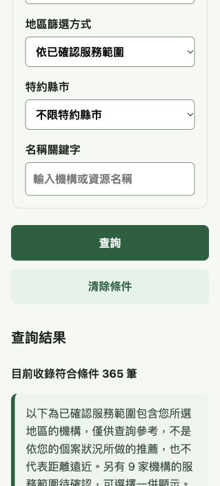
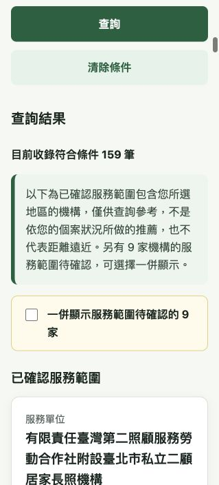

# J-004-r15 / A-008-r4 — New Taipei official home-care catalogue

Date: 2026-10-08. Owner-authorized central execution, Issue #106. Existing Kareo acceptance project only: `ojawadobnaxduxybqolk`.

## Scope / kickoff understanding

Task: collect the official New Taipei home-care catalogue linked by its health bureau, reconcile all institutions, import public data and verify reading. A owns `data/providers/**`; central J owns spec clarification, tasks, local HTTP regression evidence and publication. Forbidden: secrets, Kareocar/other databases, paid production project, health/contact writes, inferred service coverage or consent activation. Input: current official PDF and protected staging aa7450a (800 public resources); output: all 366 dispositions and 318 new providers with 1394 confirmed area additions, read verification and traceable source snapshots. Acceptance: originals intact, suspension excluded, independent source flags correct, >1000 records readable, atomic delta import and observed public version.

## Change and validation

24-page official1151007 PDF: 366 source rows, 48 merged-existing IDs, 318 new; one suspended provider excluded from active lookup/recommendation. Four outside-city offices have only evidenced New Taipei service areas. No office city is rewritten. Original 800 core Provider rows and every original Service/Area/ContractRegion row are protected; previously verified area claims remain, subsequent official claims stored separately in QA `additionalSources`.

Totals: 1118 resources / 1117 ACTIVE; 517 home-care / 516 ACTIVE; 3 home-medical/nursing, 581 assistive merchants and 17 query-only centers. Services1101, areas2517, contracts588, public metadata1111. Coordinates for new providers are null. Re-extraction from actual PDF matched all366 public rows exactly; source hashes and exhaustive reconciliation passed. Data QA71/71. Dev gate115 PASS,0 FAIL,49 PENDING.

LOCAL-04 now reads every active Provider beyond the 1000-row boundary and every New Taipei official service-area result via real local HTTP/PostgREST; it checks outside-city eligibility and suspended detail rejection. All50 local cases retained. Latest-head CI and all50 real localHTTP cases passed; actual execution references are recorded below.

The public snapshot adapter previously discarded every outside-city office by location even when confirmed service areas were in New Taipei. It now accepts ACTIVE institutions with directly sourced Taipei/New Taipei service areas; assessments and query filters still reject other service cities. Public adapter tests compare real recommendations with the official district evidence and check suspension/cross-city eligibility. No backend business logic was changed.

First head89b6d94: all8 engineeringCI jobs passed, but LOCAL-15's obsolete expectation of DISTANCE for the entire New Taipei catalogue correctly failed: new source providers lack verified coordinates and must downgrade. The revision asserts full-catalogue DISTRICT_ROTATION with null distances, then verifies distance ordering in a controlled LOCAL-only fixture using three existing officially verified providers. LOCAL-28 proves a real DISTANCE→DISTRICT_ROTATION downgrade after removing one coordinate in that same controlled fixture. It does not add coordinates or remove source providers from the actual dataset. LOCAL-30 now checks ACTIVE count rather than including a suspended provider. The revised head e61026ad0f193456156624f6c815e231ee45f1c4 passed all50 real localHTTP cases before merge.

## Guarded cloud import plan

Before mutation four current cloud table counts/hashes: providers800 `8c7d0f47df51ae0179f8779636af245a` (excluding public_info), services783 `28780366bb05d5c0df526a73f0f5ae3d`, areas1123 `93a04dc6c980c2818bac7ded6ef01128`, contracts588 `173f7e4d333cd349126623db3c461e65`. Lock and re-check them in the same transaction; call existing atomic `import_provider_dataset` with new rows only, update only public metadata for the48 retained IDs, and verify the original protected IDs' hashes again before COMMIT. No schema or RLS change; no health or Lead operations.

This guarded plan was executed successfully; actual results are recorded below and in PR #109 comment6054943114. Pages is a static publication of real public records with local rules, not the server API or formal49 deployed E2E. D-05 remains DRAFT and J-003 Integrated remains false.

## Executed closeout — 2026-10-08

- Feature PR [#109](https://github.com/viz963-1216/Kareo/pull/109) merged into staging. Tested head: `e61026ad0f193456156624f6c815e231ee45f1c4`; merged source / published catalogue: `ba9a813dc58cb7fafac5544c1f07750f0ab7e658`.
- [Engineering CI run37741826153](https://github.com/viz963-1216/Kareo/actions/runs/37741826153): all8 jobs passed. [Real localHTTP run37741826089](https://github.com/viz963-1216/Kareo/actions/runs/37741826089/job/113194048536): all50 cases passed. These are LOCAL results, not formal deployed E2E evidence. Actual decoded job logs were reviewed. Artifact11533139653 is referenced by GitHub; its ZIP was not downloaded or independently hash-verified because the download URL returned403.
- Actual Supabase mutation used only existing Kareo acceptance project `ojawadobnaxduxybqolk`, in one transaction: locked and checked original four-table counts/hashes plus existing public metadata; inserted only318 Providers,318 Services,1394 ServiceAreas through the existing atomic import function; updated only48 retained IDs' public metadata; verified protected original rows and unrelated public metadata before COMMIT.
- Committed totals: Providers1118 / ACTIVE1117; home-care517 / ACTIVE516; Services1101; ServiceAreas2517; ContractRegions588; non-null public metadata1111. Original800 Provider core rows,783 Services,1123 Areas and588 ContractRegions remain unchanged. No original IDs were deleted. No schema, RLS or role privileges were changed.
- Independent cloud readback matched every submitted new field:318/318 Providers,318/318 Services,1394/1394 Areas and48/48 retained public-metadata updates. Official New Taipei source contributes365 active institutions; one suspended institution is excluded, and four outside-city offices retain their truthful office city and explicit New Taipei coverage.
- Nonpublic tables were unchanged:10 Sessions;0 Consents, Assessments, Profiles, RecommendationRuns/Items and Leads;21 KnowledgeRecords and21 KnowledgeVersionRecords. No real health/contact information was submitted.
- Published [public resource page](https://viz963-1216.github.io/Kareo/#/resources). Its live version marker was observed with sourceCommit `ba9a813dc58cb7fafac5544c1f07750f0ab7e658`, providerCount1118 and workingTreeDirty=false. Publication artifact commit: `d4976bbc8bd5d4a1a35ee1c1649fb063d85a6aa3` on demo-pages, using normal push.
- Actual browser operation: choose 居家照顧 → 新北市 → 依已確認服務範圍. All districts returned365 institutions /19 pages; 板橋區 returned159 /8 pages. Both counts matched independently queried Supabase results. Institutions with unknown coverage are separately disclosed and are not included by default.

### Browser evidence

New Taipei, all districts,365 active institutions:

Banqiao, confirmed service area,159 institutions:

### Remaining scope

Supabase contains the same real public catalogue. The current publicly shared Pages site uses a published data snapshot and local condition filtering; it does not directly query Supabase in the browser. No server deployment or formal consent activation is claimed. New Taipei home-medical/nursing full-catalogue reconciliation and remaining unknown assistive/nursing service areas stay open in Issue #106. D-05 remains DRAFT, J-003 Integrated=false, and49 formal deployed E2E cases are not replaced by these LOCAL/public-page results.
